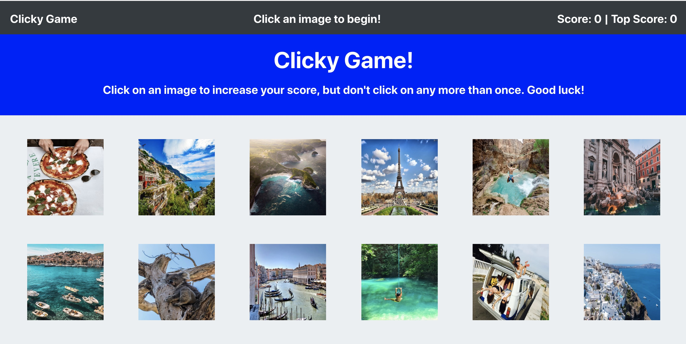
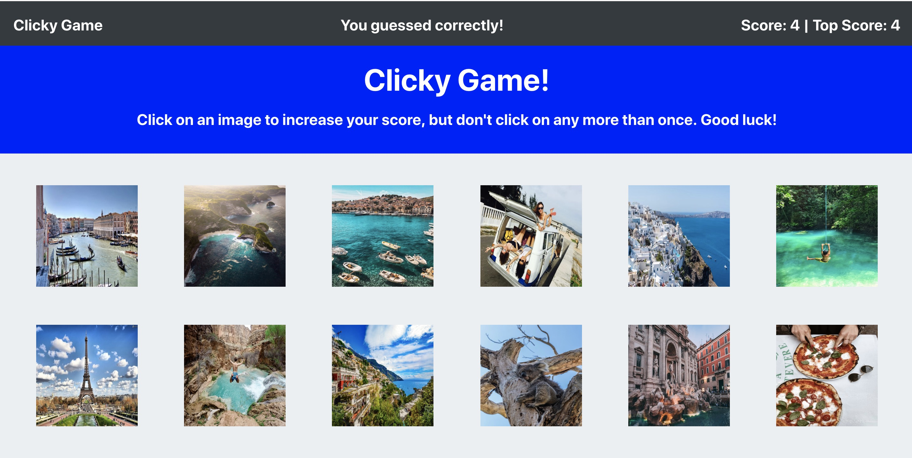
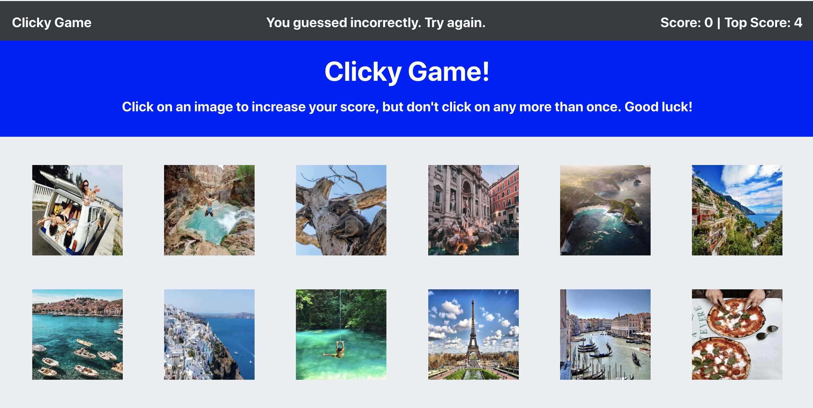

# ClickyGame ReactApp

1. The ClickGame uses the Create React App to render different images pertaining to international travel destinations to the screen. 
2. At the start of the game, the message rendered in the NavBar is "Click an image to begin!" and the Score and Top Score are equal to zero:

3. Each image listens for click events. Each time an image is clicked, 
   a. the app either increments the user's score (if image is clicked on for the first time) and displays the message, "You guessed correctly": 

   b. or resets the user's score to zero (if the same image is clicked more than once) and displays the message, "You guessed incorrectly. Try again." Once the user's score is reset after an incorrect guess, the game restarts:

   c. TopScore is updated if necessary.

   d. the images rendered to the page are shuffled in a random order.

In order to test the code, create a new React application using [Create React App](https://github.com/facebookincubator/create-react-app), replace the src folder from the app with the src folder in the ClickyGame ReactApp, and install required dependencies.